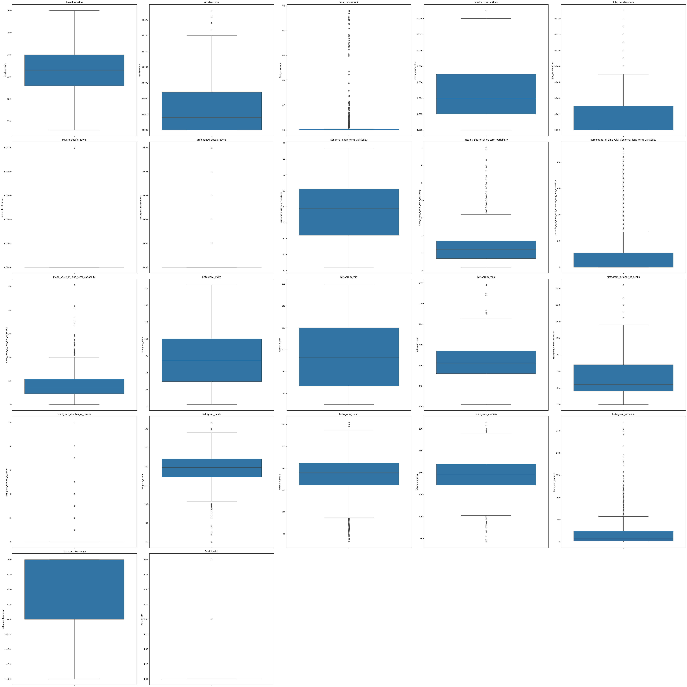
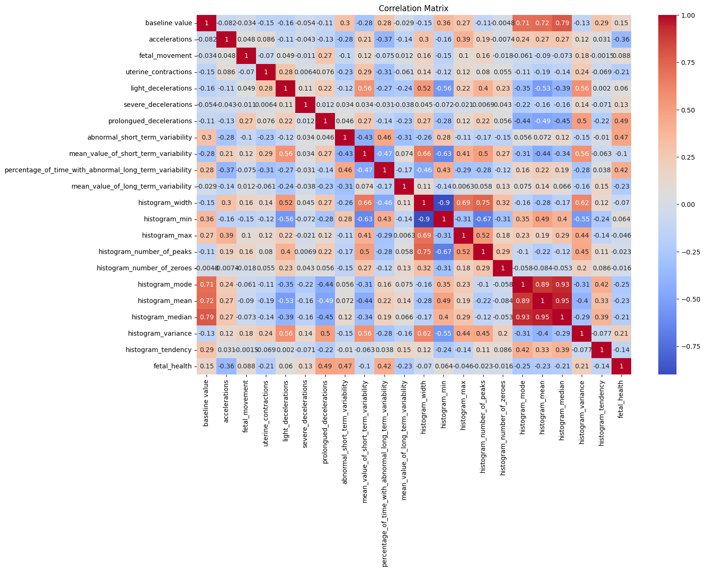
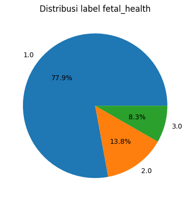
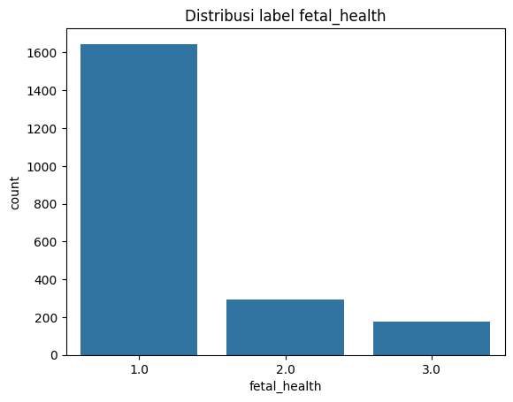
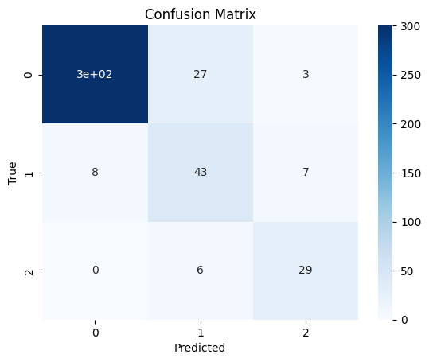
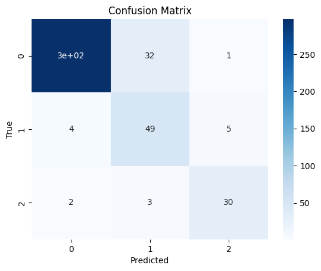

# **Laporan Proyek Machine Learning: Klasifikasi Kesehatan Janin dari Data CTG - Mohamed**


## **1. Domain Proyek**

### **Latar Belakang**

Pemantauan kondisi janin selama kehamilan sangat krusial untuk mencegah komplikasi serius, baik bagi ibu maupun bayi. Salah satu metode pemantauan yang paling umum digunakan dalam dunia medis adalah **kardiotokografi (CTG)**, yaitu teknik yang merekam detak jantung janin dan kontraksi uterus.

Namun, interpretasi CTG masih mengandalkan pengamatan manual oleh tenaga medis, yang bisa bersifat subjektif dan bervariasi antar praktisi. Menurut data dari **World Health Organization (WHO)**, sekitar 2,4 juta bayi meninggal pada bulan pertama kehidupannya setiap tahun, dan banyak dari kematian ini dapat dicegah dengan deteksi dini dan perawatan yang tepat \[1].

Oleh karena itu, dibutuhkan sistem klasifikasi otomatis berbasis **machine learning (ML)** untuk membantu dokter dalam menginterpretasi data CTG secara objektif, cepat, dan akurat. Beberapa penelitian sebelumnya, seperti oleh Mehbodniya et al. (2022) dan Salini et al. (2024), menunjukkan bahwa model machine learning dapat meningkatkan akurasi klasifikasi kesehatan janin secara signifikan \[2]\[3].

---

### **Referensi**

\[1] World Health Organization. (2020). *Newborns: reducing mortality*. [https://www.who.int/news-room/fact-sheets/detail/newborns-reducing-mortality](https://www.who.int/news-room/fact-sheets/detail/newborns-reducing-mortality)

\[2] Mehbodniya, A. et al. (2022). *Fetal health classification from cardiotocographic data using machine learning*. Expert Systems, 39(6), e12899.

\[3] Salini, Y. et al. (2024). *Cardiotocography data analysis for fetal health classification using machine learning models*. IEEE Access, 12, 26005–26022.

---

## **2. Business Understanding**

### **Problem Statements**

* Bagaimana mengklasifikasikan kondisi kesehatan janin berdasarkan data CTG menjadi “normal”, “suspect”, dan “pathological”?
* Apakah model machine learning mampu mengenali janin dalam kondisi “suspect” dan “pathological” dengan akurasi dan konsistensi yang tinggi?

### **Goals**

* Membangun model machine learning yang mampu memprediksi label `fetal_health` dengan akurasi tinggi.
* Mengidentifikasi model terbaik yang dapat digunakan sebagai alat bantu diagnosis kondisi janin.

### **Solution Statements**

Untuk mencapai tujuan, solusi yang diterapkan meliputi:

1. **Penerapan Multi-Model**:
   Membangun dan membandingkan performa dari **4 algoritma**:

   * Support Vector Machine (SVM)
   * K-Nearest Neighbors (KNN)
   * Random Forest
   * Gradient Boosting

2. **Evaluasi Terukur**:
   Setiap model dievaluasi berdasarkan metrik:

   * **Accuracy**
   * **Precision**
   * **Recall**
   * **F1-Score**

3. **Balancing & Preprocessing**:
   Mengatasi class imbalance dengan **SMOTE**, serta melakukan **scaling** agar model lebih robust.

---

## **3. Data Understanding**

### **Sumber Data**

Dataset: [Fetal Health Classification Dataset – Kaggle](https://www.kaggle.com/datasets/andrewmvd/fetal-health-classification)
Jumlah data: 
- 22 kolom
- 2126 baris

Jumlah fitur: **21 fitur numerik + 1 target**

### **Deskripsi Target**

* **fetal\_health**:

  * `1.0` = Normal
  * `2.0` = Suspect
  * `3.0` = Pathological

### **Daftar Kolom**

Berikut adalah penjelasan singkat per kolom dalam satu kalimat per poin: 

1. **`baseline_value`**: Detak jantung dasar janin yang diukur dalam denyut per menit.
2. **`accelerations`**: Jumlah kenaikan mendadak detak jantung janin per detik.
3. **`fetal_movement`**: Jumlah gerakan janin yang terdeteksi per detik.
4. **`uterine_contractions`**: Intensitas kontraksi rahim yang terukur per detik.
5. **`light_decelerations`**: Penurunan ringan detak jantung janin dalam periode tertentu.
6. **`severe_decelerations`**: Penurunan drastis dan signifikan pada detak jantung janin.
7. **`prolongued_decelerations`**: Penurunan detak jantung janin yang berlangsung cukup lama.
8. **`abnormal_short_term_variability`**: Persentase waktu saat variabilitas jangka pendek dianggap tidak normal.
9. **`mean_value_of_short_term_variability`**: Nilai rata-rata perubahan cepat detak jantung janin dari detik ke detik.
10. **`percentage_of_time_with_abnormal_long_term_variability`**: Persentase waktu saat variabilitas jangka panjang tidak normal.
11. **`mean_value_of_long_term_variability`**: Nilai rata-rata perubahan detak jantung janin dalam jangka waktu panjang.
12. **`histogram_width`**: Selisih antara nilai maksimum dan minimum detak jantung dalam histogram.
13. **`histogram_min`**: Nilai detak jantung terendah yang terekam dalam histogram.
14. **`histogram_max`**: Nilai detak jantung tertinggi yang terekam dalam histogram.
15. **`histogram_number_of_peaks`**: Jumlah puncak dalam histogram detak jantung janin.
16. **`histogram_number_of_zeroes`**: Jumlah nilai nol dalam histogram detak jantung.
17. **`histogram_mode`**: Nilai detak jantung yang paling sering muncul.
18. **`histogram_mean`**: Rata-rata keseluruhan nilai detak jantung dalam histogram.
19. **`histogram_median`**: Nilai tengah dari distribusi detak jantung dalam histogram.
20. **`histogram_variance`**: Tingkat penyebaran nilai detak jantung dalam histogram.
21. **`histogram_tendency`**: Arah kecenderungan naik atau turunnya detak jantung berdasarkan histogram.

### **Kondisi Dataset**
Terdapat 13 data duplikat dan 0 data null sehingga diperlukan penanganan terhadap data agar tidak mengganggu akurasi dari model.

### **Struktur Data**

```python
<class 'pandas.core.frame.DataFrame'>
RangeIndex: 2126 entries, 0 to 2125
Data columns (total 22 columns):
 #   Column                                                  Non-Null Count  Dtype  
---  ------                                                  --------------  -----  
 0   baseline value                                          2126 non-null   float64
 1   accelerations                                           2126 non-null   float64
 2   fetal_movement                                          2126 non-null   float64
 3   uterine_contractions                                    2126 non-null   float64
 4   light_decelerations                                     2126 non-null   float64
 5   severe_decelerations                                    2126 non-null   float64
 6   prolongued_decelerations                                2126 non-null   float64
 7   abnormal_short_term_variability                         2126 non-null   float64
 8   mean_value_of_short_term_variability                    2126 non-null   float64
 9   percentage_of_time_with_abnormal_long_term_variability  2126 non-null   float64
 10  mean_value_of_long_term_variability                     2126 non-null   float64
 11  histogram_width                                         2126 non-null   float64
 12  histogram_min                                           2126 non-null   float64
 13  histogram_max                                           2126 non-null   float64
 14  histogram_number_of_peaks                               2126 non-null   float64
 15  histogram_number_of_zeroes                              2126 non-null   float64
 16  histogram_mode                                          2126 non-null   float64
 17  histogram_mean                                          2126 non-null   float64
 18  histogram_median                                        2126 non-null   float64
 19  histogram_variance                                      2126 non-null   float64
 20  histogram_tendency                                      2126 non-null   float64
 21  fetal_health                                            2126 non-null   float64
dtypes: float64(22)
memory usage: 365.5 KB
```

### **EDA (Exploratory Data Analysis)**

* Visualisasi distribusi tiap fitur untuk deteksi outlier menggunakan Boxplot.
#### Hasil Visualisasi


* Korelasi antar fitur untuk menghindari multikolinearitas menggunakan Heatmap
#### Hasil Visualisasi


* Distribusi kelas target menggunakan Pie chart dan Bar chart
#### Hasil Visualisasi 




---

## **4. Data Preparation**

Menghapus data duplikat dari dalam dataset agar dapat membuat proses pelatihan model menjadi lebih mudah dan tidak memberikan data sampah kepada model

```python
df.drop_duplicates(inplace=True)
```

Data independen dan dependen atau label dipisahkan terlebih dahulu, dimana variabel X memuat data independen sedangkan variabel y memuat data dependen atau label, hal ini dilakukan agar dapat menyiapkan data untuk bisa dilakukan proses splitting data.
```python
X = df.drop(['fetal_health'],axis = 1)
y = df['fetal_health']
```

Selanjutnya dilakukan splitting data menjadi data latih  dan data tes, dengan perbandingan 80 : 20 , 80 % untuk data latih dan 20 % untuk data tes. dengan menambahkan argumen stratify pada argumen fungsi supaya menjaga distribusi dari kelas.
```python
X_train , X_test , y_train , y_test = train_test_split(X,y , test_size = 0.2 , stratify=y , random_state = 42)
```

Setelah dilakukan data splitting, dilakukan proses normalisasi pada data latih guna mempermudah model dalam melakukan prediksi data.

```python
Scaler = MinMaxScaler()
X_train = Scaler.fit_transform(X_train)
X_test = Scaler.transform(X_test)
```

Terakhir, dilakukan augmentasi data pada data latih menggunakan SMOTE untuk bisa menyeimbangkan data pada masing-masing kelas terutama pada data dengan label 2.0 dan 3.0
```python
smote = SMOTE()
X_train_resampled , y_train_resampled = smote.fit_resample(X_train , y_train)
```

## **5. Modeling**

## 1. K-Nearest Neighbors (KNN)

### Deskripsi:
KNN adalah algoritma klasifikasi (atau regresi) berbasis instance-based learning. Saat memprediksi, KNN mencari `k` tetangga terdekat dari data uji dan menggunakan mayoritas kelas dari tetangga tersebut.

### Rumus (jarak Euclidean):
$$d(x, x_i) = \sqrt{\sum_{j=1}^{n} (x_j - x_{ij})^2}$$

**Keterangan:**
- $d(x, x_i)$ : Jarak Euclidean antara titik uji $$x$$ dan data latih ke- $$i$$
- $x$ : Vektor fitur dari data uji  
- $x_i$ : Vektor fitur dari data latih ke- $$i$$  
- $x_j$ : Nilai fitur ke- $$j$$ pada data uji  
- $x_{ij}$ : Nilai fitur ke- $$j$$ pada data latih ke- $$i$$  
- $n$ : Jumlah fitur (dimensi data)

### Parameter:
- `n_neighbors=5`: jumlah tetangga yang dipertimbangkan  
- `weights='uniform'` : semua tetangga memiliki bobot yang sama  
- `metric='minkowski'`, `p=2` : menggunakan jarak Euclidean  

### Kelebihan:
- Sederhana dan mudah dipahami  
- Cocok untuk dataset kecil  
- Tidak memerlukan pelatihan (lazy learning)  

### Kekurangan:
- Sensitif terhadap outlier  
- Lambat pada dataset besar  
- Sensitif terhadap skala fitur (butuh normalisasi)  

---

## 2. Random Forest

### Deskripsi:
Random Forest adalah metode ensemble berbasis pohon keputusan. Algoritma ini membangun banyak decision tree secara acak, lalu menggabungkan hasilnya untuk prediksi (voting atau rata-rata).

### Rumus (voting mayoritas):
$$\hat{y} = \text{mode}(T_1(x), T_2(x), \ldots, T_k(x))$$

**Keterangan:**
- $T_i(x)$ : prediksi dari decision tree ke $$i$$  
- $\hat{y}$ : hasil prediksi akhir  

### Parameter:
- `n_estimators=300`: jumlah pohon  
- `max_depth=2`: kedalaman maksimum pohon 
- `random_state=42`: agar hasil bisa direproduksi  

### Kelebihan:
- Tahan terhadap overfitting  
- Menangani data tidak seimbang dengan baik  
- Memberikan informasi pentingnya fitur  
- Bekerja baik pada data numerik maupun kategorikal  

### Kekurangan:
- Lambat untuk pelatihan data besar  
- Tidak sebaik gradient boosting untuk prediksi presisi tinggi  
- Agak sulit untuk interpretasi individual tree  

---

## 3. Support Vector Machine (SVM)

### Deskripsi:
SVM mencari hyperplane optimal yang memisahkan kelas dengan margin terbesar. Cocok untuk data berdimensi tinggi dan linear/non-linear tergantung kernel yang digunakan.

### Rumus (untuk SVM linear):
$$\min_{w,b} \frac{1}{2} \|w\|^2 \quad \text{dengan syarat: } y_i(w \cdot x_i + b) \geq 1$$

**Keterangan:**
- $w$ : vektor bobot  
- $b$ : bias  
- $x_i$ : data ke- $$i$$  
- $y_i$ : label data ke- $$i$$  
- Margin = $$\frac{2}{\|w\|}$$

### Parameter:
- `C=1.0`: parameter regulasi  
- `kernel='rbf'`: kernel radial basis function  
- `gamma='scale'`: parameter skala untuk kernel  

### Kelebihan:
- Akurat untuk data berdimensi tinggi  
- Bisa menangani data non-linear dengan kernel  
- Efektif jika data punya margin pemisahan yang jelas  

### Kekurangan:
- Lambat untuk dataset besar  
- Boros memori  
- Parameter kernel dan regulasi harus disetel dengan hati-hati  

---

## 4. Gradient Boosting

### Deskripsi:
Gradient Boosting adalah metode ensemble yang membangun model secara bertahap, di mana setiap model baru mengoreksi kesalahan dari model sebelumnya.

### Rumus (prediksi iteratif):
$$F_{m}(x) = F_{m-1}(x) + \gamma_m h_m(x)$$

**Keterangan:**
- $F_{m}(x)$ : model pada iterasi ke- $$m$$ 
- $h_m(x)$ : decision tree kecil (weak learner) ke- $$m$$
- $\gamma_m$ : learning rate  
- Model meminimalkan loss: $$\mathcal{L}(y, F(x))$$

### Parameter:
- `n_estimators=100`: jumlah boosting stage  
- `learning_rate=0.1`: ukuran langkah koreksi tiap model  
- `max_depth=3`: kedalaman pohon  

### Kelebihan:
- Akurasi tinggi di banyak kompetisi dan masalah real-world  
- Bisa menangani data kategorikal dan numerik  
- Bisa dikontrol dengan tuning (learning rate, max depth)  

### Kekurangan:
- Overfitting jika tidak dikontrol  
- Pelatihan lambat  
- Sensitif terhadap parameter  

---

## **6. Evaluation**

### **Metrik Evaluasi**

1. **Accuracy**

   $$Accuracy = \frac{TP + TN}{TP + TN + FP + FN}$$

2. **Precision**

   $$Precision = \frac{TP}{TP + FP}$$

3. **Recall**

   $$Recall = \frac{TP}{TP + FN}$$

4. **F1-Score**

   $$F1 = 2 \times \frac{Precision \times Recall}{Precision + Recall}$$

#### Keterangan
- $TP$ : jumlah prediksi benar untuk nilai positif oleh model
- $TN$ : jumlah prediksi benar untuk nilai negatif oleh model
- $FP$ : jumlah prediksi salah untuk nilai positif oleh model
- $FN$ : jumlah prediksi salah untuk nilai negatif oleh model


### **Hasil Evaluasi**

| Model             | Accuracy | Precision | Recall   | F1-Score |
| ----------------- | -------- | --------- | -------- | -------- |
| KNN               | 0.88     | 0.90      | 0.88     | 0.89     |
| Random Forest     | 0.85     | 0.87      | 0.85     | 0.86     |
| SVM               | 0.90     | 0.92      | 0.90     | 0.91     |
| Gradient Boosting | **0.94** | **0.93**  | **0.94** | **0.93** |


#### **Confusion Matrix KNN**



#### **Confusion Matrix RF**


#### **Confusion Matrix SVM**




#### **Confusion Matrix GradientBoosting**


### **Model Terbaik**

Berdasarkan hasil evaluasi terhadap masing-masing model, **Gradient Boosting** merupakan model terbaik dikarenakan memiliki skor evaluasi tertinggi secara konsisten di semua metrik. Model ini dipilih karena:

* Performa prediksi terbaik
* Kemampuan menangani kompleksitas non-linear
* Meningkatkan recall pada kelas minoritas berkat SMOTE

### Keterkaitan dengan Business understanding
1. **Apakah sudah menjawab pertanyaan problem statement ?**

* Bagaimana mengklasifikasikan kondisi kesehatan janin berdasarkan data CTG menjadi “normal”, “suspect”, dan “pathological”?

* Apakah model machine learning mampu mengenali janin dalam kondisi “suspect” dan “pathological” dengan akurasi dan konsistensi yang tinggi?

Dua pertanyaan tersebut sudah terjawab dengan adanya model GradientBoosting yang dapat melakukan prediksi dengan akurat terhadap kondisi kesehatan janin menjadi “normal”, “suspect”, dan “pathological” , terlihat dari metrik akurasi , presisi, reacll, dan skor F1 yang berada di angka diatas 90% 

2. **Apakah sudah berhasil mencapai setiap goals yang ada ?**

* Membangun model machine learning yang mampu memprediksi label `fetal_health` dengan akurasi tinggi.

* Mengidentifikasi model terbaik yang dapat digunakan sebagai alat bantu diagnosis kondisi janin.

Sudah terpenuhi, dibuktikan dengan adanya model GradientBoosting yang dapat melakukan prediksi secara akurat dengan metrik akurasi , presisi, reacll, dan skor F1 yang berada di angka diatas 90% yang merupakan model terbaik dibandingkan dengan model lain seperti SVM , KNN , dan Random Forest.

3. **Apakah setiap solution statement yang direncanakan berpengaruh ?**

Sangat berpengaruh, pengujian terhadap 4 model dapat memberikan variasi pilihan serta memberikan pandangan mengenai model yang terbaik dalam hal memprediksi data dari status kesehatan janin,penggunaan metrik pengukuran seperti akurasi,  presisi, recall, dan skor f1 penting dalam menentukan model terbaik ,selain itu juga penggunaan SMOTE dalam proses augmentasi data latih dapat membantu meningkatkan akurasi dari keempat model.


